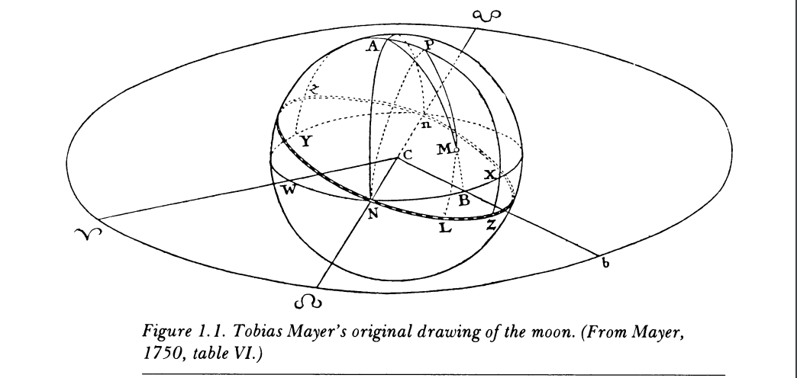

```{r setup, include=FALSE}
knitr::opts_chunk$set(
  echo = TRUE,
  R.options = list(width = 60)
  )
library(knitr)
```

The slides are [here](https://rohanalexander.com/pdfs/smile_talk.pdf). 

## Introduction

Hi, my name is Rohan Alexander. I'm an assistant professor at the University of Toronto in the Faculty of Information and the Department of Statistical Sciences. I'm also the assistant director of CANSSI Ontario, and I'd encourage you all to go to our website - https://canssiontario.utoronto.ca/ - and apply for funding from our programs.

I'd like to thank Josh and Kartheik for the opportunity to talk today. 

I know that it's an auspicious time for all you astronomy-inclined folks with the imminent launch of the James Webb Space Telescope, so I appreciate you coming to listen to me. Hopefully in a year, I can come back and you can tell me about all the wonderful datasets James Webb has provided all of you.

Today I'd like to talk a little about what I see data science as, and why I think astronomers are so good at it; and then talk about a few examples of my work, focusing more on sharing my process and what I learnt, rather than the work itself; and finally close with some open questions.

None of what I'm about to say is cannon, this talk is more my way of trying to work out what I think, so I'd appreciate your reactions and comments.


## What is data science?

When we think about data science, I think that we all have different things in mind. 

The only thing that is certain, is that there is no agreed definition of data science, but a lot of people have tried. For instance, @hads say it is '...an exciting discipline that allows you to turn raw data into understanding, insight, and knowledge.' Similarly, @leekpeng say it is '...the process of formulating a quantitative question that can be answered with data, collecting and cleaning the data, analyzing the data, and communicating the answer to the question to a relevant audience.' @nick say it is '...the science of extracting meaningful information from data.' And @tiffany say they define 'data science as the process of generating insight from data through reproducible and auditable processes'.

@Craiu2019Hiring, who is one of Josh's bosses and also one of mine, argues that the lack of certainty as to what data science is, might not matter because '...who can really say what makes someone a poet or a scientist?' He goes on to broadly say that a data scientist is '...someone with a data driven research agenda, who adheres to or aspires to using a principled implementation of statistical methods and uses efficient computation skills.'

Regardless of who is right, alongside those specific, more-technical, definitions, there is value in having a simple definition, even if we lose a bit of specificity. For instance, probability is often informally defined as 'counting things' [@richard, p. 10]. In a similar informal sense, data science can be defined as something like: 'humans measuring stuff, typically related to other humans, and using sophisticated averaging to explain and predict'.

That may sound a touch cute, but Francis Edgeworth, the nineteenth century statistician and economist considered statistics to be the science 'of those Means which are presented by social phenomena,' so it is in good company [@edgeworth1885methods]. 

In any case, one feature of this definition is that it does not treat data as *terra nullius*, or nobody's land. Statisticians tend to see data as the result of some process that we can never know, but that we try to use data to come to understand. Many statisticians care deeply about data and measurement, but there are many cases in statistics where data kind of just appear; they belong to no one. But that is never actually the case.

Data must be gathered, cleaned, and prepared, and these decisions matter. Every dataset is *sui generis*, or a class by itself, and so when you come to know one dataset well, you just know one dataset, not all datasets.

In my experience, this fact is ingrained into astronomers. My guess is that it's because most of you get into astronomy being the actual data collectors - that is, you loved looking at the sky through telescopes when you were a kid. Eventually you got more sophisticated and layered on physics and math, but I think that astronomers make such great data scientists because you're fundamentally lashed to the data collection process.


More broadly, I think that much of data science focuses on the 'science,' but it is important that we also focus on 'data.' And that is another feature of my cutesy definition of data science which I posited before. A lot of data scientists are generalists, who are interested in a broad range of problems. Often, the thing that unites these is the need to gather, clean, and prepare messy data. And often it is the specifics of those data that require the most time, that update most often, and that are worthy of our most full attention. Unfortunately, it's not typically the type of thing that is professionally rewarded.


## Astronomical origins

At this point I'd like to look back, for a moment, at the origins of data science. As astronomers, I know that you all are used to looking back in time. My PhD is in economic history, so I'm also very keen on looking back in time also, although usually only decades or centuries, rather than the billions of years that you all tend to look back! Anyway, if we look at the history of statistics, we very quickly find ourselves in astronomy.

For instance, speaking about the development of least squares in the 1700s, @stigler[p.16] describes how it was associated with the following problems:

1. Determining the motion of the moon in a way that takes into account minor perturbations.
2. Reconciling the non periodic motion of Jupiter and Saturn.
3. Determining the shape of the earth.

The very stuff of astronomy! 

In the work associated with least squares, we see statistical names that we still speak of today including Euler, Gauss, and Laplace. But it may be of interest to you all as astronomers that @stigler describes the papers at the time as 'a story of statistical success (by a major astronomer, Mayer (Figure \@ref(fig:iceberg)) and statistical failure (by a leading mathematician, Euler)'! 


```{r, iceberg, fig.show="hold",  echo=FALSE, fig.cap="Example of Mayer from Stigler, 1986", out.width="85%"}

```


The fundamental issue at the time with least squares was that of hesitancy to combine different observations. These days, we just take this for granted and do it without thinking much about it. But if one steps back for a moment, one quickly sees why this was such a mental leap. And again, here we have astronomers, as you are so immersed in your data, as bringing a unique perspective.

Comparing Euler and Mayer, @stigler [p. 28] says: 

> The two men brought absolutely first-rate intellects to bear on their respective problems, and both problems were in astronomy. Yet there was an essential conceptual difference in their approaches that made it impossible for Euler'.... The differences were these: Mayer approached his problem as a practical astronomer, dealing with observations that he himself had made under what he considered essentially similar observational conditions, despite the differing astronomical conditions. Euler, on the other hand, approached his problem as a mathematician, dealing with observations made by others over several centuries under unknown observational conditions. Mayer could regard errors, or variation, in his observations as random'... and he could take the step of aggregating equations without fear that bad observations would contaminate good ones'.... Euler could not bring himself to accept such a view with respect to his data. He '... [took]  the mathematician's view that errors actually increase with aggregation rather than taking the statistician's view [and here Stigler should actually also add astronomers] that random errors tend to cancel one another.'...

On the other hand, @stigler criticism of Mayer is that '...He made no attempt to describe his calculation as a method that would be useful in other problems. He did not do what Legendre did, namely, abstract the method from the application where it first appeared.' Namely astronomy!


In any case, by around 1800, least squares became more widely appreciated. But, oddly, not in my own area of interest---namely social sciences, where we would take another 70 or 80 years, a veritable lifetime, before we widely applied it. 

Before we return to the present, I'd be remiss if I didn't mention one final historical astronomer, Quetelet. In this talk I'm arguing that it is your foundation in data gathering that makes you such great data scientists. And this is going to be an example where that feature held back social sciences.

Quetelet was a Belgium astronomer, but he also had social sciences interests and made foundational contributions in terms of the 'average man' and 'fitting distributions'. I'd like to touch on a circumstance where his being deeply involved in the data was a handicap. 

@stigler [p. 163] describes how by 1826 Quetelet had become involved in the statistical bureau, and they were planning for a census. As some of you who have taken courses with my wife, Monica Alexander, know, the foundation of demography is births, deaths, and migration. Quetelet argued that births and deaths had been taken care of, but migration had not. He proposed a ratio estimator based on counts in specific geographies---think provinces---which could then be scaled up to the whole country. There was various criticism of this plan, mostly focused on how one could possibly pick appropriate geographies, and Stigler describes how Quetelet then changed his mind.

@stigler continues

> He [Quetelet] was acutely aware of the infinite number of factors that could affect the quantities he wished to measure, and he lacked the information that could tell him which were indeed important. He, like the generation of social scientists to follow, was reluctant to group together as homogenous, data that he had reason to believe was not'.... In some respects, Quetelet's view of his social data was like Euler's view of astronomical data. To be aware of a myriad of potentially important factors, without knowing which are truly important and how their effect may be felt, is often to fear the worst'.... He [Quetelet] could not bring himself to treat large regions as homogeneous, [and so] he could not think of a single rate as applying to a large area'... Astronomers had overcome a similar case of intellectual cold feet in the previous century by comparing observations with fact, by comparing prediction with realization. Success had bolstered confidence in the combination of observations. Social scientists were to require massive empirical data gathered under a wide variety of circumstances before they gained the astronomers' confidence that the quantities they measured were of sufficient stability that the uncertainty of the estimates was itself susceptible to measurement.


## On balance between data and science

Returning to the present, as I've been saying, one of the reasons that I think astronomers make such great data scientists, is that you are used to knowing that your data is a biased sample that comes to you via instruments---in your case telescopes.

We always use various instruments to turn the world into data. In astronomy, the development of better telescopes, and eventually satellites and probes, and soon, hopefully, James Webb, enabled new understanding of other worlds. For instance, returning to history again for just a moment, Stigler (1986, p.25) describes how knowledge of that second problem that I mentioned---Jupiter/Saturn non-periodic motion---was 'due to improved accuracy of astronomical observations'. Returning to the present day, we similarly have new instruments for turning our own world into data being developed each day. 

In the social sciences, a census was once a generational-defining event. And it's appropriate that this talk happens near the Christmas holidays given the role that the census played in that event. But now we have regular surveys, transactions data available by the second, and almost all interactions on the internet become data of some kind. The development of such instruments has enabled exciting new stories to be told with data.

The telescope that we all hope is launching soon---James Webb---has a unique feature, compared with its predecessor in popular imagination - Hubble. And that feature is that it will be sent to L2. My understanding, and please correct me after the talk if I'm wrong, is that the defining feature of L2 is that the Earth's gravity and the Sun's gravity and the moon to a certain extent, effectively hold objects there without much in the way of rocket thrust being needed. So the side of the telescope with the instrumentation that needs to be kept cold and dark, can more easily always be kept cold and dark. And so, in this case James Webb can stay there for about 10 years, focusing on answering big questions, without much in the way of needing to worry about pointing the wrong way. We should all be so lucky!

In a way, for James Webb, being at L2 is all about getting the balance right so that it can focus on answering big questions. And I think for the past ten years or so, we've had the balance wrong in data science. There has been too much focus on the 'science' bit, without sufficient focus on the 'data' bit. And we all know what happens when you go too close to the sun.


It is not just the 'science' bit that is hard, it is the 'data' bit as well. I feel that Foster would have known this, and we are just reinventing things. For instance, researchers went back and examined one of the most popular text datasets in computer science, and they found that around 30 per cent of the data were inappropriately duplicated [@bandy2021addressing]. There is an entire field—linguistics—that specialises in these types of datasets, and inappropriate use of data is one of the dangers of any one field being hegemonic. The strength of data science is that it brings together folks with a variety of backgrounds and training to the task of learning about some dataset. It is not constrained by what was done in the past. But this means that we must go out of our way to show respect for those who do not come from our own tradition, but who are nonetheless as similarly interested in a dataset, or in a question, as we are. 

I'm picking on CS a little here, but my home of the social sciences is just as bad and researchers like me are trying to refocus us on data a little more than we have been in the past. 

So what are some examples of things that I work on?

## Examples of my work

I mentioned that my PhD is in economic history, but I spent most of my PhD trying to deal with big text datasets. And when I say 'dealing' I mean using R to clean and tidy them, which was the work of years. My supervisors—John Tang, Tim Hatton, Martine Mariotti, and Zach Ward—gave me the freedom to do what I wanted, with regular weekly meetings. It's not a topic that traditionally would have been appropriate in economics, and I'm grateful they gave me the space because traditional economics is not for me, but data science is. 

### Effect of elections and changed prime ministers

One result of this work was the paper---*The Increased Effect of Elections and Changing Prime Ministers on Topics Discussed in the Australian Federal Parliament between 1901 and 2018*---[@alexander2021increased] which was co-authored with my wife Monica. In Australia there is a written record of what is said in parliament called Hansard. We grabbed the text of everything said between 1901 and 2018 and then built a statistical model to look at whether the topics of discussion changed when there was an election or when there was a change in the prime minister. We found that changes in prime minister tend to be associated with topic changes even when the party in power does not change; and the effect of elections has been increasing since the 1980s, regardless of whether the election results in a change of prime minister.

#### Lesson: Always start small and then iterate.

I came to that paper hopelessly naive and lost. I didn't know that text analysis, and natural language processing more generally, was something that was incredibly popular. I didn't have the skills that I needed, and really all I had was an all-consuming interest in the broad area---I didn't even have a question. The dataset has over a billion words in it. So the main lesson for me was in dealing with big datasets. And here I don't mean in terms of technical skills, I mean in terms of approach. These days when I have students and they want to use the Hansard or any large dataset, I start by insisting that they just use one month of data. After they analyse and write that up, then they can go to a year, and then they can continue to build up slowly.

The reason that I know now that's the best way to go is that I somehow convinced myself that I couldn't possibly answer any interesting questions until I had a century worth of data. And because I was teaching myself everything as I went, it took me more than a year to just get the data into a usable format.

If you take nothing away from this talk, please I beg you take this away: the most important, vital thing, is that you create a minimal viable product of any research. And that minimal viable product needs to be something that you can finish within a week. If you can't do that then adjust the scope and the question until you can. Then you achieve that MVP and then you start to scale up to the question that you're interested in, which is hopefully something that can be published.

### Explaining Why Text is Sexist or Racist with GPT-3

As anyone who has cared for young children knows, the response to almost any statement can be 'why?'. One can quickly find oneself trying to explain the finer details of photosynthesis to a 3-year-old, and the extent to which one struggles with this tends to put in sharp relief the extent of one's knowledge. Large language models such as OpenAI's GPT-3 can generate text that is indistinguishable from that created by humans. They can also classify whether some given text is sexist or racist [@chiu2021detecting].

In the paper---*Explaining Why Text is Sexist or Racist with GPT-3*---which was co-authored by Ke-Li Chiu we assess the extent to which GPT-3 can generate explanations for why a given text is sexist or racist. We prompt GPT-3 to generate explanations in a question-and-answer manner: 'Is the following statement in quotes sexist? Answer yes or no and explain why.' We then assess the adequacy of the explanations generated by GPT-3. We are interested in firstly, the extent to which it correctly classifies whether the statements are sexist/racist; and secondly, the reasonableness of the explanation that accompanies that classification.

We find that GPT-3 does poorly in the open-ended approach. When we add more structure to guide its responses the model performs better. But even when it correctly classifies racism or sexism, the accompanying explanations are often inaccurate. At times they even contradict the classification. On a technical level, we find a clear relationship between the hyper-parameter temperature and the number of correctly matched attributes, with substantial decreases as temperature increases.

#### Lesson: Always teach

I just used a bunch of terms there and you probably assume that I know what they mean. In writing the paper that preceded this one, I actually fooled myself into thinking that I knew what they meant. It wasn't until I tried to teach the material that I realised that I didn't have a clue what was going on. 

A lot of my colleagues try to get out of teaching, and I can understand why they would think that, but I've found that having to teach has made me a better researcher. For one reason, I found that it's too easy to fool yourself into thinking you know something until you have to explain it. And I also kind of think that a lot of us in academia need pressure, constraints, and a weekly structure, in order to do our best work. 

### Reproducibility of COVID-19 pre-prints

The final paper that I'd like to touch on is---*Reproducibility of COVID-19 pre-prints*---by Annie Collins and me [@collins2021reproducibility]. In that paper we are interested in the reproducibility of COVID-19 research. We create a dataset of pre-prints posted to arXiv, bioRxiv, medRxiv, and SocArXiv between 28 January 2020 and 30 June 2021 that are related to COVID-19. We extract the text from these pre-prints and parse them looking for keyword markers signalling the availability of the data and code underpinning the pre-print. For the pre-prints that are in our sample, we are unable to find markers of either open data or open code for 75 per cent of those on arXiv, 67 per cent of those on bioRxiv, 79 per cent of those on medRxiv, and 85 per cent of those on SocArXiv. We conclude that there may be value in having authors categorize the degree of openness of their pre-print as part of the pre-print submissions process, and more broadly, there is a need to better integrate open science training into a wide range of fields.

#### Lesson: You always need the code more than once

I went into that paper thinking that I'd just quickly write some code to download some files and then be done with it. But then Annie wanted to broaden the scope of the paper, so the code needed to be re-written because she couldn't understand what I'd done. And then we had to re-run the code because we wanted to update everything before she presented the paper. And that meant re-writing things. And then we to re-run the code before we submitted the paper. Again that meant re-writing things.

We eventually just turned the code into an R package, which is on CRAN as [heapsofpapers](https://rohanalexander.github.io/heapsofpapers/) [@heaps]. Which is what I should have done from the start. The lesson that I learnt from this paper is that regardless of how certain you are that you'll never use some particular code again, you'll always need it.

## Open questions

### How do we write unit tests for data science?

One thing that working with real computer scientists has taught me is the importance of unit tests. Basically this just means writing down the small checks that we do in our heads all the time. Like if we have a column that purports to the year, then it's unlikely that it's a character, and it's unlikely that it's an integer larger than 2500, and it's unlikely that it's a negative integer. We know all this, but writing unit tests has us write this all down.

In this case it's obvious what the unit test looks like. But more generally, we often have little idea what our results should look like if they're running well. The approach that I've taken is to add simulation---so we simulate reasonable results, write unit tests based on that, and then bring the real data to bear and adjust as necessary. But I really think that we need extensive work in this area because the current state-of-the-art is lacking.

### What happened to the revolution?

I don't understand what happened to the promised machine learning revolution in social sciences. Specifically, I'm yet to see any convincing application of machine learning methods that are designed for prediction to a social sciences problem where what we care about is understanding. I would like to either see evidence of them or a definitive thesis about why this can't happen. The current situation is untenable where folks, especially those in fields that have been historically female, are made to feel inferior even though their results are no worse.

### How do we think about power? 

As someone who learnt statistics from economists, but now is partly in a statistics department, I do think that everyone should learn statistics from statisticians. This isn't anything against economists, but the conversations that I have in the statistics department about what statistical methods are and how they should be used are very different to those that I've had in other departments.

I think the problem is that people outside statistics, treat statistics as a recipe in which they follow various steps and then out comes a cake. With regard to 'power'---it turns out that there were a bunch of instructions that no one bothered to check---they turned the oven on to some temperature without checking that it was 180C, and that's fine because whatever mess came out was accepted because the people evaluating the cake didn't know that they needed to check the temperature had been appropriately set. (I'm ditching this analogy right now).

As you know, the issue with power is related to the broader discussion about p-values, which basically no one is taught properly, because it would require changing an awful lot about how we teach statistics i.e. moving away from the recipe approach.

And so, my specific issue is that people think that statistics is a recipe to be followed. They think that because that's how they are trained especially in social sciences like political science and economics, and that's what is rewarded. But that's not what these methods are. Instead, statistics is a collection of different instruments that let us look at our data in a certain way. I think that we need a revolution here, not a metaphorical tucking in of one's shirt.

## Thank you

Right. So I think I'll leave it there. Thank you again to Josh and Kartheik for inviting me. 

Let's cross our fingers for a successful launch of James Webb next week and its subsequent deployment. I do hope that you invite me back when you start getting data from it to analyse!

This is also my last talk for this year, so I'll take this opportunity to say Merry Christmas, Happy Holidays, and I hope everyone has a wonderful start to 2022.

I'd be happy to take any questions.


## Acknowledgments {.appendix}

Thanks very much to Josh for the invitation to speak, and to Monica Alexander for her suggestions and comments.
